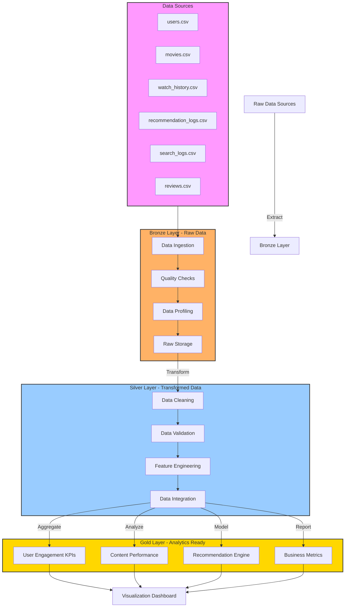

# 🎬 Netflix User Engagement Analytics Pipeline

## 🏗️ ETL Architecture


## 📊 Project Overview
This project implements a robust data pipeline for analyzing Netflix-style streaming platform data, featuring user behavior analytics, content performance metrics, and engagement patterns. The pipeline processes data through Bronze, Silver, and Gold layers, providing actionable insights for business decisions.

## 🔄 Pipeline Architecture Overview

### 1. Bronze Layer (Data Ingestion)
- **Raw Data Ingestion**: Automated ingestion of CSV files
- **Data Profiling**: Automated quality checks and statistics
- **Schema Validation**: Basic data type and structure validation
- **Quality Monitoring**: Tracking data completeness and validity

### 2. Silver Layer (Data Processing)
- **Data Cleaning**: Handling missing values, duplicates, and outliers
- **Data Integration**: Merging related datasets
- **Feature Engineering**: Creating derived metrics and indicators
- **Data Validation**: Enforcing business rules and constraints

### 3. Gold Layer (Analytics)
- **KPI Computation**: Calculating business metrics
- **Aggregations**: User and content-level summaries
- **ML Features**: Prepared datasets for modeling
- **Business Metrics**: Ready-to-use analytics views

### 🎯 Key Metrics
- **User Engagement Scores**
- **Content Performance Analytics**
- **Viewing Pattern Analysis**
- **Recommendation Engine Effectiveness**
- **Platform Usage Insights**

---

## 📁 Data Pipeline Structure

### Source Data (210,290+ records)
| Dataset | Records | Purpose |
|---------|---------|----------|
| `users.csv` | 10,300 | Core user information and demographics |
| `movies.csv` | 1,040 | Content catalog and metadata |
| `watch_history.csv` | 105,000 | User viewing behavior tracking |
| `recommendation_logs.csv` | 52,000 | Recommendation system performance |
| `search_logs.csv` | 26,500 | Search behavior analysis |
| `reviews.csv` | 15,450 | User feedback and sentiment |

### Pipeline Layers

#### 🥉 Bronze Layer (Raw)
- Raw data storage
- Data quality reports
- Schema validation results
- Ingestion metadata

#### 🥈 Silver Layer (Processed)
- Cleaned datasets
- Integrated views
- Feature engineered tables
- Validated data models

#### 🥇 Gold Layer (Analytics)
- User engagement metrics
- Content performance KPIs
- Recommendation insights
- Business analytics views

---

## 🛠️ Pipeline Data Quality Management

### Bronze Layer Quality Checks
- **Completeness Monitoring**: Track missing values (10-15% across columns)
- **Duplicate Detection**: Identify duplicate records (3-6% per table)
- **Schema Compliance**: Validate data types and structures
- **Data Freshness**: Monitor ingestion timestamps

### Silver Layer Data Cleaning
- **Missing Value Handling**:
  - Implement imputation strategies
  - Track imputation quality metrics
  - Document missing patterns
- **Deduplication Process**:
  - Remove system-generated duplicates
  - Handle natural duplicates with business rules
  - Maintain duplicate resolution logs
- **Anomaly Detection & Handling**:
  - Age validation (5-110 years range)
  - Spending patterns ($200-1000/month)
  - Viewing duration analysis (5-13 hours)
  - Content duration verification

### Gold Layer Quality Assurance
- **KPI Validation**: Ensure metric accuracy
- **Data Consistency**: Cross-reference checks
- **Business Rule Compliance**: Validate against rules
- **Quality Reporting**: Generate quality scorecards

---

## 🤖 Machine Learning Use Cases

### 1. **Churn Prediction** 🎯
- Target: `is_active` in users table
- Features: Watch patterns, engagement metrics, demographics
- **Models**: Logistic Regression, Random Forest, XGBoost

### 2. **Recommendation Systems** 🔮
- Collaborative filtering using user-movie interactions
- Content-based filtering with movie features
- **Models**: Matrix Factorization, Neural Collaborative Filtering

### 3. **Content Popularity Forecasting** 📈
- Predict trending content based on early engagement
- Time-series analysis of viewing patterns
- **Models**: ARIMA, Prophet, LSTM

### 4. **Sentiment Analysis** 💭
- Review text classification and sentiment scoring
- Multi-class sentiment prediction
- **Models**: BERT, RoBERTa, Transformer-based models

### 5. **User Segmentation** 👥
- Behavioral clustering based on viewing patterns
- RFM analysis (Recency, Frequency, Monetary)
- **Models**: K-Means, DBSCAN, Gaussian Mixture Models

### 6. **Search Intent Classification** 🔍
- Classify user search queries by intent
- Query suggestion and auto-completion
- **Models**: TF-IDF + SVM, Word2Vec, BERT

---

## 🗂️ Schema Details

### Users Table
```
user_id (str): Unique identifier
email (str): User email address
first_name (str): First name
last_name (str): Last name
age (float): Age in years [Missing: 12%]
gender (str): Gender category [Missing: 8%]
country (str): USA or Canada
state_province (str): State/Province
city (str): City name
subscription_plan (str): Basic, Standard, Premium, Premium+
subscription_start_date (date): When user subscribed
is_active (bool): Current subscription status
monthly_spend (float): Monthly spending amount [Missing: 10%]
primary_device (str): Main viewing device
household_size (int): Number of people in household [Missing: 15%]
created_at (datetime): Account creation timestamp
```

### Movies Table
```
movie_id (str): Unique identifier
title (str): Content title
content_type (str): Movie, TV Series, Documentary, etc.
genre_primary (str): Main genre
genre_secondary (str): Secondary genre [Missing: 40%]
release_year (int): Year of release
duration_minutes (float): Runtime in minutes
rating (str): Content rating (G, PG, R, etc.)
language (str): Primary language
country_of_origin (str): Production country
imdb_rating (float): IMDB score [Missing: 15%]
production_budget (float): Budget in USD [Missing: 20%]
box_office_revenue (float): Revenue in USD [Missing: 25%]
number_of_seasons (int): For series content
number_of_episodes (int): Total episodes
is_netflix_original (bool): Platform original content
added_to_platform (date): When added to platform
content_warning (bool): Has content warnings
```

### Watch History Table
```
session_id (str): Unique session identifier
user_id (str): References users.user_id
movie_id (str): References movies.movie_id
watch_date (datetime): When viewing occurred
device_type (str): Viewing device
watch_duration_minutes (float): Time watched [Missing: 8%]
progress_percentage (float): Completion percentage [Missing: 12%]
action (str): started, completed, stopped, paused
quality (str): HD, 4K, SD, Ultra HD [Missing: 5%]
location_country (str): Viewing location
is_download (bool): Downloaded for offline viewing
user_rating (float): User rating if provided [Missing: 85%]
```

---

## 🚀 Getting Started

### Quick Analysis Examples

```python
import pandas as pd
import numpy as np
import matplotlib.pyplot as plt
import seaborn as sns

# Load data
users = pd.read_csv('users.csv')
movies = pd.read_csv('movies.csv')
watch_history = pd.read_csv('watch_history.csv')

# Quick exploration
print("Dataset shapes:")
print(f"Users: {users.shape}")
print(f"Movies: {movies.shape}")
print(f"Watch History: {watch_history.shape}")

# Check data quality issues
print("\nMissing values:")
print(users.isnull().sum().sum())
print(f"Duplicates in users: {users.duplicated().sum()}")

# Basic visualization
plt.figure(figsize=(12, 4))
plt.subplot(1, 3, 1)
users['age'].hist(bins=30)
plt.title('Age Distribution')

plt.subplot(1, 3, 2)
users['subscription_plan'].value_counts().plot(kind='bar')
plt.title('Subscription Plans')

plt.subplot(1, 3, 3)
watch_history['action'].value_counts().plot(kind='pie')
plt.title('Watch Actions')
plt.tight_layout()
plt.show()
```

### Data Cleaning Workflow
```python
# Handle missing values
users['age'].fillna(users['age'].median(), inplace=True)
users['gender'].fillna('Unknown', inplace=True)

# Remove duplicates
users_clean = users.drop_duplicates(subset=['email'], keep='first')

# Handle outliers
Q1 = users['monthly_spend'].quantile(0.25)
Q3 = users['monthly_spend'].quantile(0.75)
IQR = Q3 - Q1
users_filtered = users[
    (users['monthly_spend'] >= Q1 - 1.5 * IQR) & 
    (users['monthly_spend'] <= Q3 + 1.5 * IQR)
]
```

---

## 🏷️ Recommended Tags for Kaggle
```
streaming, netflix, recommendation-systems, churn-prediction, 
user-behavior, content-analysis, machine-learning, deep-learning,
time-series, nlp, sentiment-analysis, data-cleaning, synthetic-data,
entertainment, media-analytics, user-segmentation
```

---

## 📈 Potential Research Questions

1. **What factors contribute most to user churn?**
2. **How does content genre preference vary by demographics?**
3. **Can we predict content virality from early viewing patterns?**
4. **What search patterns indicate high-intent users?**
5. **How do device preferences affect viewing behavior?**
6. **What's the optimal recommendation algorithm for this platform?**

---

## 🔗 Connect & Contribute

This dataset is perfect for:
- 📚 **Students**: Learning data science and ML
- 🏢 **Companies**: Benchmarking recommendation systems
- 🔬 **Researchers**: Testing new algorithms
- 👨‍💻 **Developers**: Building portfolio projects

**Created with**: Python, Pandas, NumPy, Faker
**License**: MIT (Free for commercial and academic use)
**Last Updated**: August 2025

---

## 🎯 Next Steps
1. **Explore the data** using the provided examples
2. **Clean and preprocess** using the suggested workflows
3. **Build models** for your specific use case
4. **Share your findings** and contribute back to the community!

Happy analyzing! 🚀
